# iPhone Purple

Catálogo y panel de gestión para una casa de venta de equipos Apple en Argentina.
El cliente entra, ve qué hay **en stock hoy**, cotiza su equipo usado y cierra por
WhatsApp. Del otro lado, el panel carga las listas que mandan los proveedores por
WhatsApp, les aplica el margen y registra las ventas.

No hay carrito ni checkout: las ventas se cierran por WhatsApp y se registran desde
el panel, que es como funciona el negocio de verdad.

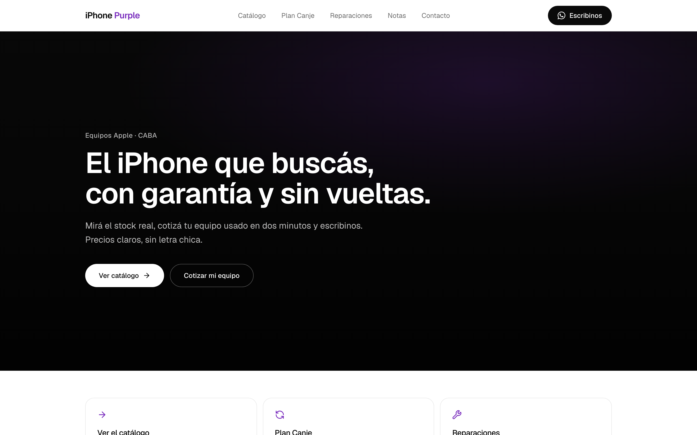

---

## Índice

- [Qué hace](#qué-hace)
- [Arrancar en dos minutos](#arrancar-en-dos-minutos)
- [Cómo está armado](#cómo-está-armado)
- [El importador de listas de WhatsApp](#el-importador-de-listas-de-whatsapp)
- [Base de datos](#base-de-datos)
- [Capturas](#capturas)
- [Calidad y seguridad](#calidad-y-seguridad)
- [Comandos](#comandos)
- [Desplegar](#desplegar)

---

## Qué hace

### Para quien compra

| Página                | Qué resuelve                                                               |
| --------------------- | -------------------------------------------------------------------------- |
| **Inicio**            | Hero con video de fondo y tres accesos: catálogo, canje, reparaciones      |
| **Catálogo**          | Búsqueda y filtros por modelo, capacidad, estado y stock — todo en la URL  |
| **Ficha de producto** | Fotos, specs, selector de capacidad/color/estado y consulta por WhatsApp   |
| **Plan Canje**        | Cotizador: cuánto te tomamos tu equipo y cuánto ponés de diferencia        |
| **Reparaciones**      | Servicios con precio orientativo y consulta directa                        |
| **Notas**             | Blog con guías y comparativas                                              |
| **Contacto**          | Dirección, horarios, redes y un formulario que arma el mensaje de WhatsApp |

### Para quien administra

| Sección            | Qué resuelve                                                            |
| ------------------ | ----------------------------------------------------------------------- |
| **Resumen**        | Stock valorizado, margen potencial, ventas del mes, equipos por reponer |
| **Importar lista** | Pegás el WhatsApp del proveedor y sale publicado con margen aplicado    |
| **Productos**      | Edición de precio y stock en línea, con el margen por fila a la vista   |
| **Ventas**         | Alta de venta que descuenta stock y calcula margen                      |
| **Plan Canje**     | Consultas del cotizador, con estado y botón para responder por WhatsApp |
| **Proveedores**    | Margen por defecto de cada uno y acceso para pedirles la lista          |
| **Configuración**  | Cotización del dólar, contacto y redes, sin tocar código                |

---

## Arrancar en dos minutos

```bash
git clone git@github.com:gregoriomartocci/iphone-purple.git
cd iphone-purple
npm install
npm run dev
```

Listo — **no hace falta configurar nada** para ver el sitio completo.

Sin base de datos, la capa de datos sirve un catálogo de demostración
(`lib/data/seed.ts`): 15 equipos, servicios de reparación, tabla de canje y notas.
Todo el sitio se puede recorrer, buscar y filtrar. Cuando cargues las claves de
Supabase, pasa a Postgres sin que haya que tocar ni una página.

### Ir a datos reales

```bash
cp .env.example .env.local
```

Después completá:

| Variable                                                                                     | Para qué                                       | Sin esto                              |
| -------------------------------------------------------------------------------------------- | ---------------------------------------------- | ------------------------------------- |
| `NEXT_PUBLIC_SUPABASE_URL`<br>`NEXT_PUBLIC_SUPABASE_ANON_KEY`<br>`SUPABASE_SERVICE_ROLE_KEY` | Catálogo, ventas y leads reales                | Se usa la semilla; el panel no guarda |
| `AUTH_SECRET`                                                                                | Sesiones del panel (`openssl rand -base64 32`) | No podés entrar al panel              |
| `ANTHROPIC_API_KEY`                                                                          | Interpretar las listas de proveedor            | El importador no funciona             |

Después, en el SQL Editor de Supabase, aplicá en orden:

1. `lib/supabase/schema.sql` — tablas, índices, RLS y triggers
2. `lib/supabase/seed.sql` — los mismos datos de demostración, ya en Postgres

Por último, marcate como admin:

```sql
update profiles set role = 'admin' where id = '<tu-user-id>';
```

---

## Cómo está armado

**Next.js 16** (App Router, Turbopack) · **React 19** · **TypeScript** ·
**Tailwind v4** · **Supabase** (Postgres + Storage) · **Auth.js v5** ·
**Claude** para interpretar las listas · **Vitest** para los tests.

```
app/
  (store)/          Sitio público — catálogo, canje, reparaciones, blog, contacto
  (auth)/login/     Acceso al panel
  admin/            Panel interno + Server Actions
lib/
  data/             ⭐ Puerta única a los datos (Supabase ↔ semilla)
  catalog.ts        Helpers puros: precios, stock, cotización de canje
  whatsapp/         Parser de listas de proveedor
  supabase/         Clientes + schema.sql + seed.sql
components/
  site/             Componentes del sitio público
  admin/            Componentes del panel
tests/              54 tests sobre la lógica que mueve plata
```

### La decisión que sostiene todo lo demás

`lib/data/index.ts` es **la única puerta a los datos**. Decide sola si lee de
Supabase o de la semilla, y expone siempre la misma interfaz:

```ts
const products = await getProducts({ q: "iphone 15", storage: "256GB" });
```

Ninguna página sabe cuál de los dos está activo. Eso hace que el proyecto arranque
sin configuración, que los tests corran sin base de datos, y que conectar Supabase
más adelante no obligue a tocar ninguna vista.

El filtrado y el orden viven en esa capa, no en el SQL: el catálogo se comporta
**idéntico** contra Postgres y contra la semilla, así que lo que probás en
desarrollo es lo que pasa en producción.

---

## El importador de listas de WhatsApp

El problema real: cada proveedor manda su lista con un formato distinto.

```
BUEN DÍA! LISTA DE HOY 🔥
iPhone 13 128 impecable bat 89 — 470
15 pro max 256 sellado 1290 (x2)
ip 14 128gb usado 9/10 600 u$d
```

Mantener expresiones regulares para eso es una batalla perdida. En su lugar, el
texto va a Claude con **salida estructurada** (`messages.parse` + Zod), que
devuelve filas tipadas: modelo normalizado, capacidad, estado, batería, moneda,
costo y cantidad.

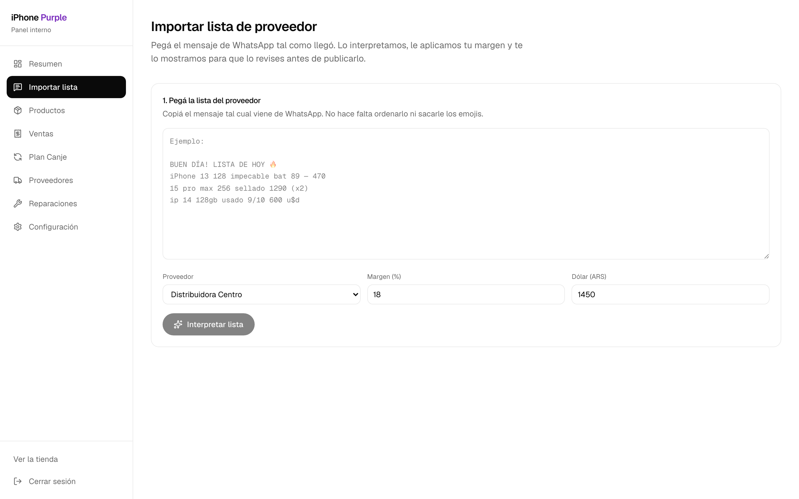

El flujo tiene tres pasos, y **el del medio no es opcional**:

1. **Pegás** el mensaje crudo y elegís proveedor, margen y cotización del dólar.
2. **Revisás** la tabla editable, con el precio de venta ya calculado por fila.
   Podés corregir cualquier celda y destildar lo que no quieras subir.
3. **Publicás** — recién ahí se escriben productos y variantes.

La interpretación automática acierta casi siempre, pero "casi" no alcanza cuando
el resultado son los precios que ve el cliente. Cada importación guarda el texto
original junto al resultado, así un parseo dudoso se puede auditar después contra
lo que realmente mandó el proveedor.

---

## Base de datos

Once tablas, sin nada de e-commerce que no se use:

- `products` / `product_variants` / `product_images` — una variante por
  combinación vendible (capacidad + color + estado)
- `suppliers` / `supplier_imports` — proveedores y el historial auditable de listas
- `sales` — ventas, con trigger que descuenta stock y numeración `IPP-2026-0001`
- `trade_in_prices` / `trade_ins` — tabla de valores y consultas del cotizador
- `repair_services`, `posts`, `store_settings`, `profiles`

**RLS activo en todas.** El sitio público solo puede _leer_ lo publicado; nada le
abre escritura al rol anónimo. Todo lo que escribe pasa por Server Actions
autenticadas. `sales`, `trade_ins`, `suppliers` y `supplier_imports` no tienen
policy de lectura a propósito: solo se acceden desde el panel.

---

## Capturas

### Catálogo y producto

Filtros y búsqueda viven en la URL, así que un filtro se puede compartir, guardar
en favoritos y sobrevive al refresh.

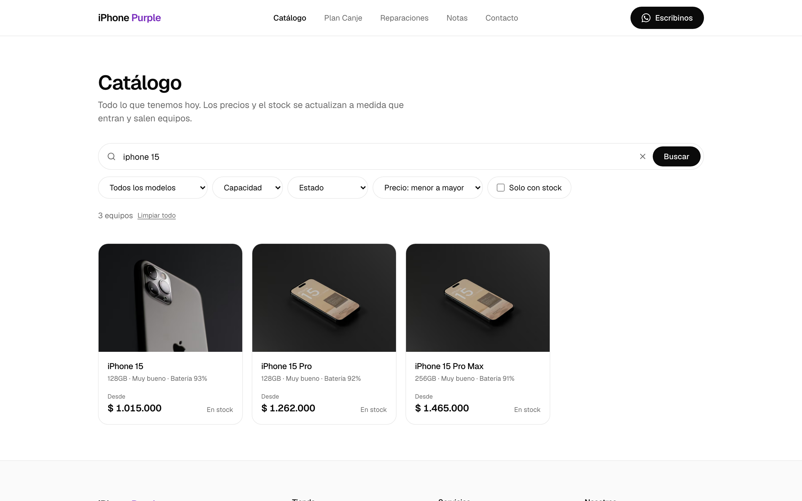
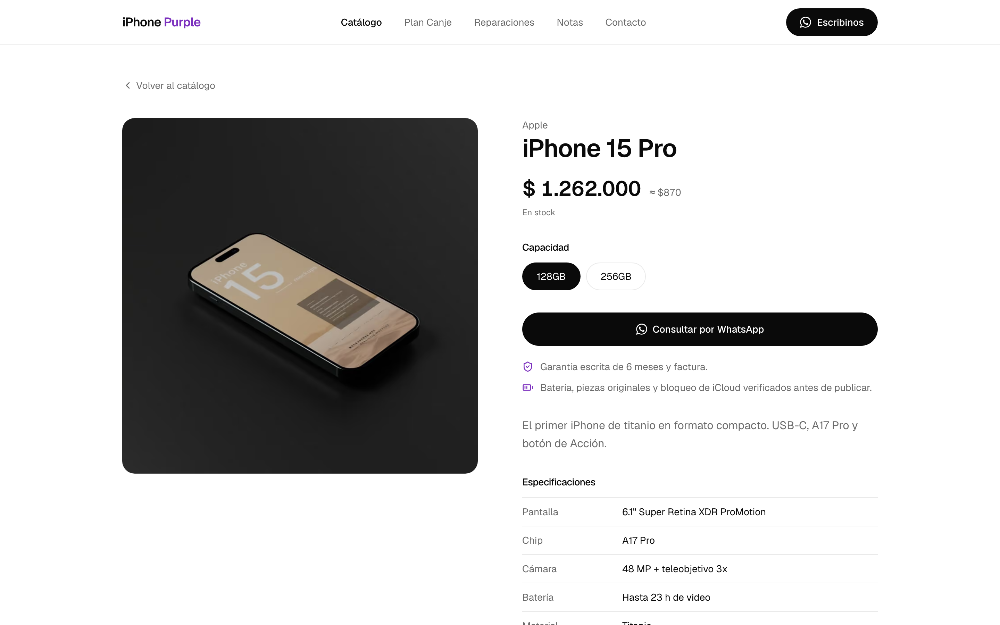

### Plan Canje

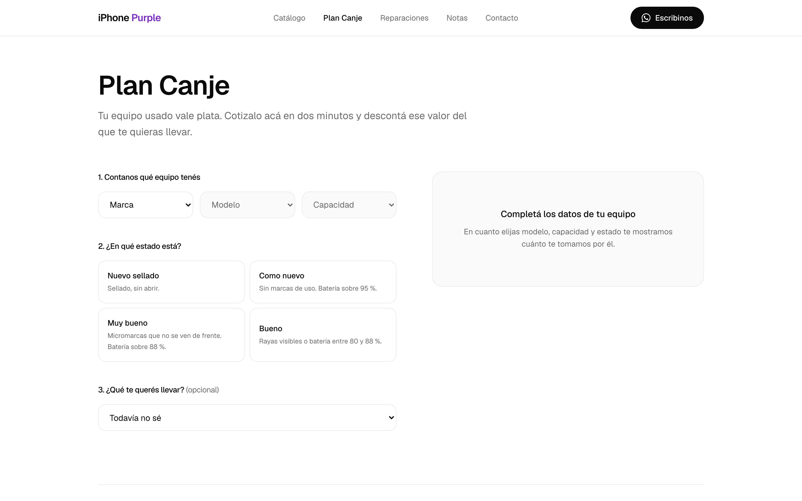

### Reparaciones y notas

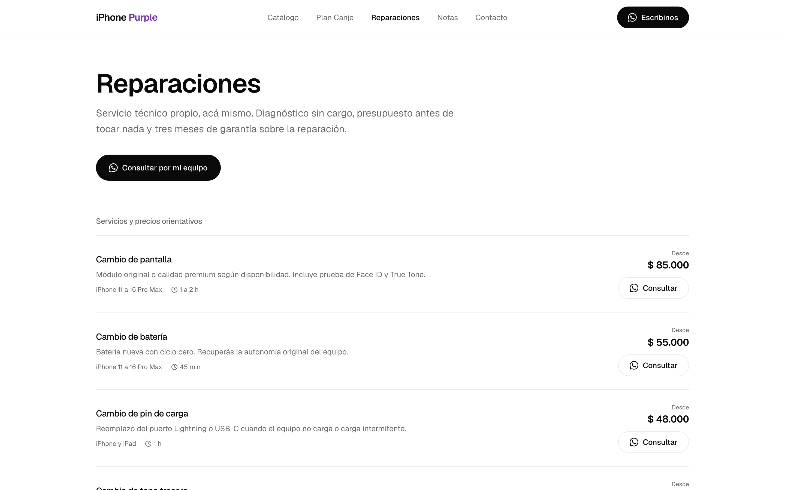


### Panel

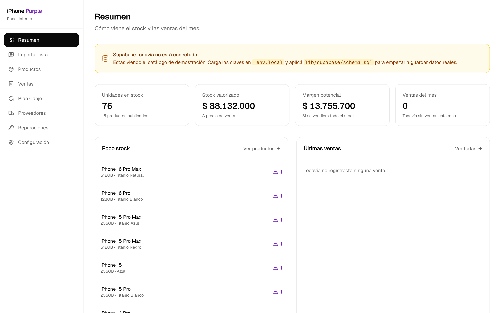
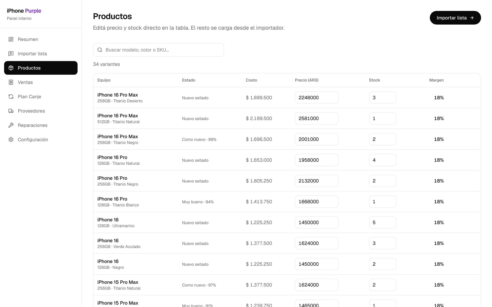

### En el teléfono

La mitad de las visitas de una tienda así llegan desde el celular.

<p align="left">
  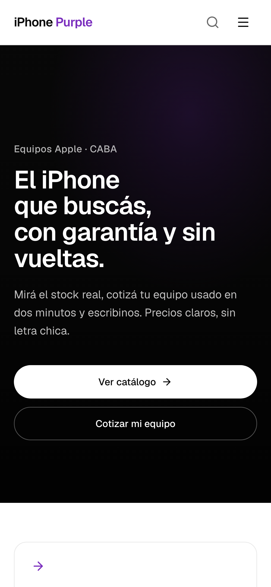
  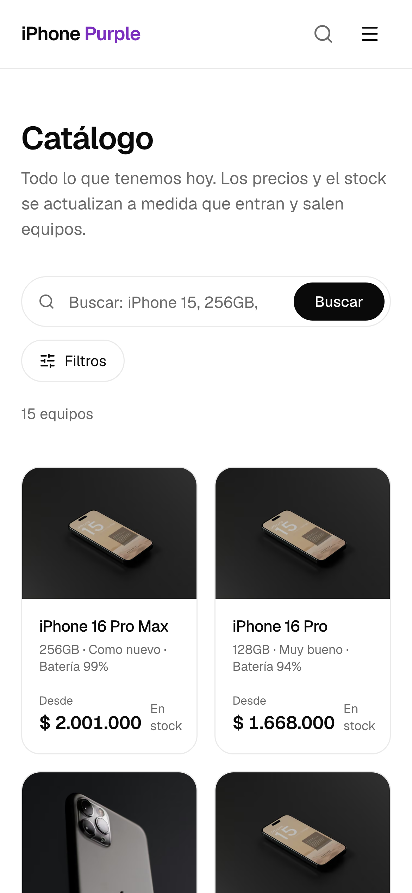
  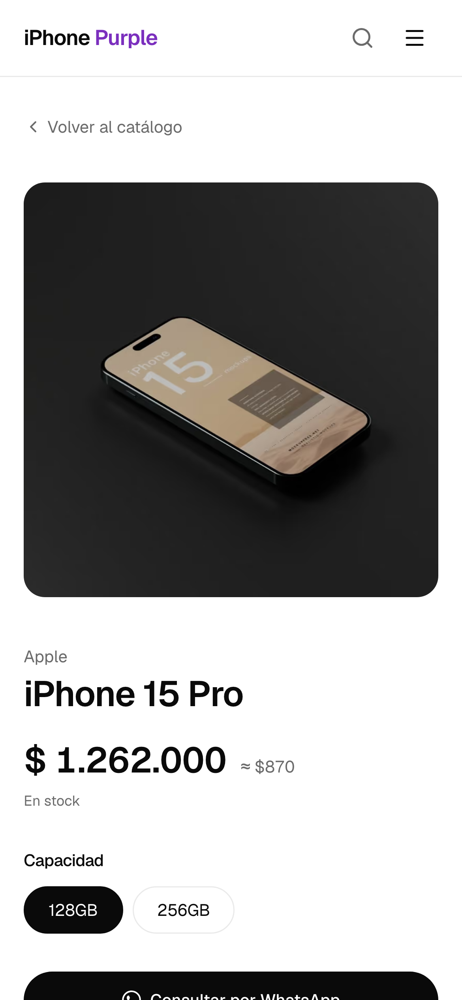
</p>

Las capturas se regeneran con `npm run screenshots` (ver `scripts/screenshots.mjs`).

---

## Calidad y seguridad

**CI en cada push y PR** (`.github/workflows/ci.yml`), en tres jobs paralelos:

| Job       | Qué corre                                                                      |
| --------- | ------------------------------------------------------------------------------ |
| Calidad   | `typecheck` · `lint` · `format:check` · `test`                                 |
| Build     | Build de producción **sin secretos**, como lo vería alguien que clona el repo  |
| Seguridad | `npm audit --audit-level=high` + verificación de que no haya `.env` versionado |

**Hooks de git** (Husky): `pre-commit` pasa ESLint y Prettier sobre lo que tocaste;
`pre-push` corre tipos y tests para no romper `main`.

**54 tests** (Vitest) concentrados donde un error cuesta plata: cálculo de margen,
redondeo de precios, cotización de canje, filtros del catálogo y armado de los
links de WhatsApp.

### Capas de seguridad

- **CSP y cabeceras** en `next.config.ts`: `frame-ancestors 'none'` contra
  clickjacking del panel, HSTS, `nosniff`, `Permissions-Policy` y `X-Frame-Options`.
- **Doble verificación de permisos.** `proxy.ts` redirige, pero cada Server Action
  **vuelve a chequear sesión y rol** por dentro: las acciones son accesibles por
  POST directo sin pasar por el proxy, así que el redirect es comodidad y la
  acción es la barrera.
- **La service role key no puede llegar al navegador.** `lib/data/admin.ts` está
  marcado con `server-only`, que convierte una importación equivocada en un error
  de build en vez de en una filtración.
- **Validación con Zod** en el borde de toda Server Action, incluidas las filas
  que devuelve el parser.
- **Cero HTML crudo.** El cuerpo de las notas se renderiza con elementos de React
  (`PostBody`), así que un texto cargado desde el panel no puede inyectar markup.
  Hay un test que lo verifica.
- **0 vulnerabilidades** en `npm audit`.

---

## Comandos

| Comando                     | Qué hace                                 |
| --------------------------- | ---------------------------------------- |
| `npm run dev`               | Servidor de desarrollo                   |
| `npm run build`             | Build de producción                      |
| `npm test`                  | Tests                                    |
| `npm run test:coverage`     | Tests con reporte de cobertura           |
| `npm run typecheck`         | Chequeo de tipos                         |
| `npm run lint` / `lint:fix` | ESLint                                   |
| `npm run format`            | Prettier                                 |
| `npm run verify`            | Todo junto: tipos → lint → tests → build |
| `npm run screenshots`       | Regenera las capturas del README         |

---

## Desplegar

Pensado para Vercel. Importás el repo, cargás las variables de `.env.example` y
listo.

Dos detalles que evitan un dolor de cabeza:

- **`NEXT_PUBLIC_APP_URL`** tiene que ser el dominio real: alimenta el sitemap,
  los datos de OpenGraph y el JSON-LD.
- **`AUTH_SECRET`** distinto al de desarrollo.

`trustHost` ya viene activado en `lib/auth.ts`, así que el panel funciona detrás
de un proxy inverso o en cualquier dominio sin quedar bloqueado por `UntrustedHost`.

### Falta cargar

- `public/hero.mp4` y `public/hero-poster.jpg` — el hero degrada elegante mientras
  tanto, pero el video es lo que le da vida.
- Fotos reales de producto (hoy son de demostración).
- Los datos de contacto reales, desde **Configuración** en el panel.
