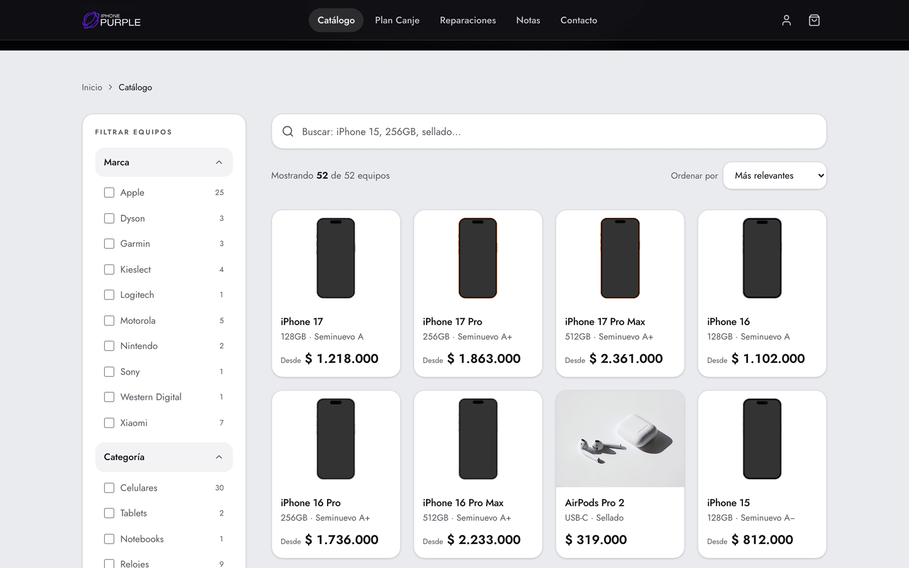
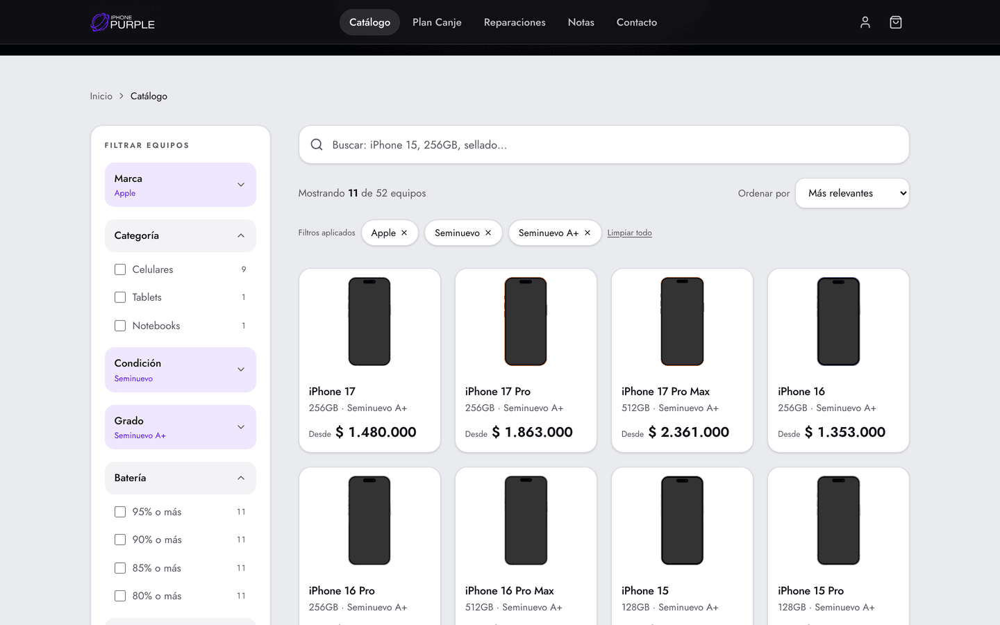
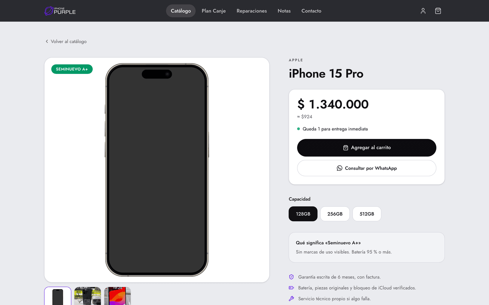
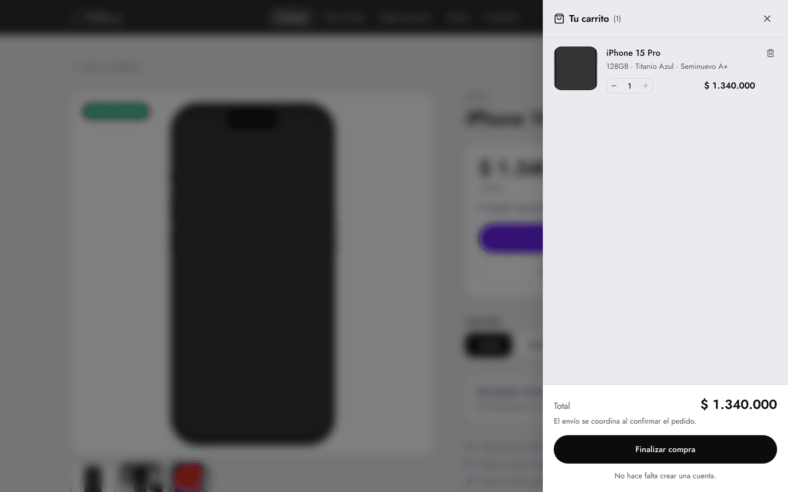
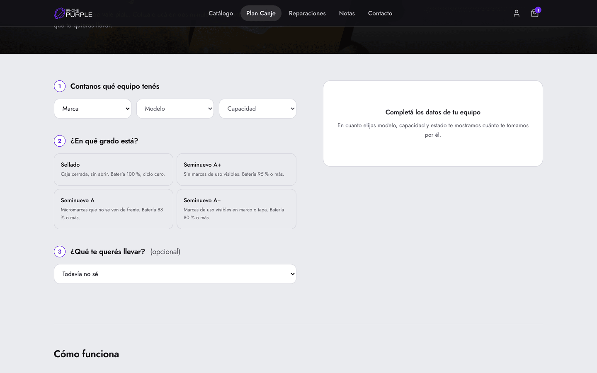
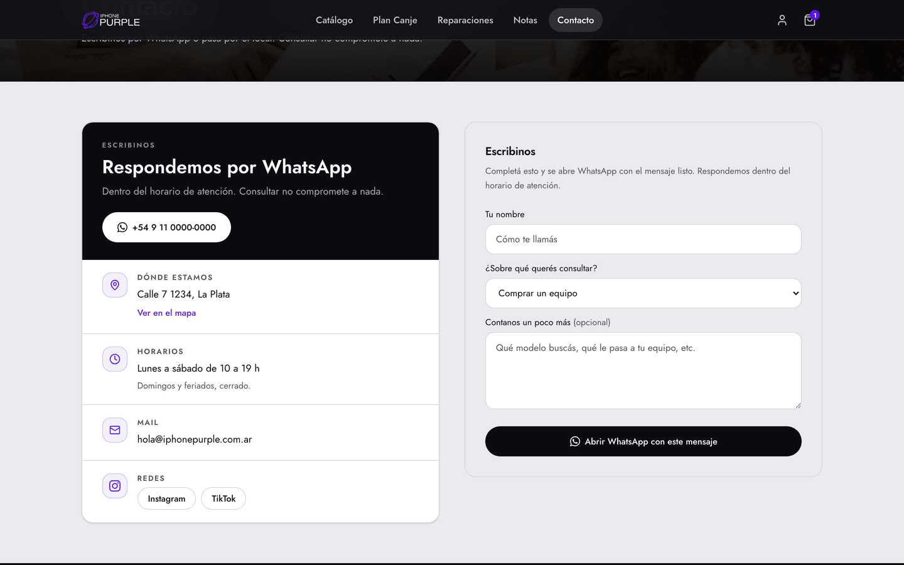
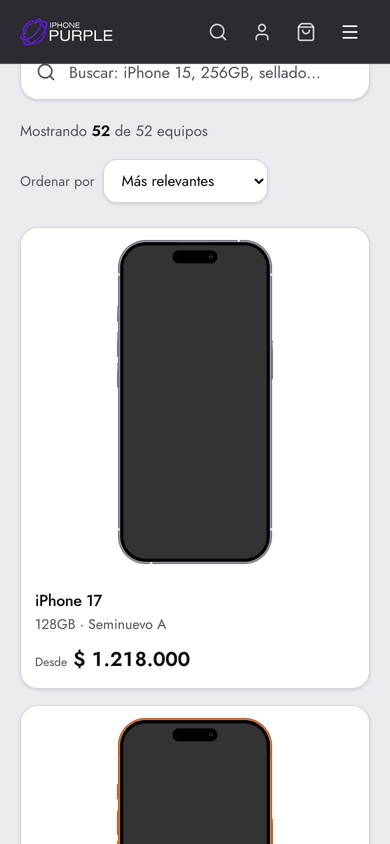

<div align="center">

# iPhone Purple

**Tienda y panel de gestión para una casa de venta de equipos Apple en La Plata.**

Catálogo con stock real · Plan Canje · Reparaciones · Carrito sin cuenta · Panel que carga las listas del proveedor desde WhatsApp

### [→ Ver el sitio en vivo](https://iphone-purple.vercel.app)

[](https://nextjs.org)
[](https://react.dev)
[](https://www.typescriptlang.org)
[](https://tailwindcss.com)
[](#calidad)
[](https://iphone-purple.vercel.app)

</div>


---

## Qué resuelve

El negocio vende equipos Apple y electrónica en La Plata. Los proveedores mandan
sus listas por WhatsApp, los clientes preguntan por WhatsApp, y el stock cambia
todos los días. Antes de esto, cada lista se cargaba a mano y el catálogo
publicado nunca coincidía con lo que había en el mostrador.

El sitio ataca las dos puntas:

- **Para quien compra** — ve el stock real con precio y condición, filtra por lo
  que le importa (marca, modelo, condición, batería, capacidad, color), arma el
  pedido y lo confirma **sin crear una cuenta**. La cuenta es opcional y sirve
  para favoritos y seguimiento.
- **Para el local** — pega el mensaje del proveedor en el panel, un modelo lo
  convierte en filas ordenadas, se le aplica el margen, se revisa y se publica.
  Además registra ventas y descuenta stock.

---

## El sitio

### Catálogo

Búsqueda y filtros **por URL**, renderizados en el servidor: un filtro aplicado
se puede compartir por link y sobrevive al refresh. Los filtros van de lo general
a lo específico —marca → categoría → modelo— y cada opción muestra cuántos
equipos la cumplen. Lo que no tiene stock no se publica.



Al elegir "seminuevo" aparecen los grados y la batería, que solo tienen sentido
ahí. Cada opción se cierra al elegirla y deja a la vista qué quedó aplicado, así
el panel no crece sin control mientras se filtra.



### Ficha de producto

Todo el detalle que la tarjeta deliberadamente no muestra: qué significa cada
grado, la batería exacta, cuánto se ahorra contra el sellado, y una comparación
con las generaciones anterior y siguiente. Elegir capacidad o color cambia el
precio **y** el mensaje de WhatsApp, para que el vendedor reciba exactamente qué
equipo miró la persona.



### Carrito sin cuenta

Se abre solo al agregar algo, entra deslizándose desde la derecha y guarda el
pedido en el navegador. El checkout no pide registro: nombre, contacto y listo.



### Plan Canje

Cotizador en cuatro pasos —marca, modelo, capacidad, estado— que devuelve el
valor de toma y, si se elige el equipo de reemplazo, **la diferencia a pagar**.
El lead queda guardado para que el local lo levante.



### Contacto

Dirección, horarios y redes en una tarjeta, con el WhatsApp como primera acción.
El formulario no manda un mail: arma el mensaje y abre WhatsApp con el texto ya
escrito, que es por donde realmente responde el local.



### En el teléfono

Una tarjeta por fila con la foto grande, filtros en un panel lateral y áreas
táctiles que se pueden acertar con el pulgar. Es por donde entra la mayoría.

<div align="center">
  
</div>

---

## El panel

Ocho secciones en `/admin`, protegidas por sesión: tablero, importador,
productos, proveedores, ventas, leads de canje, reparaciones y notas.

### El importador de WhatsApp

Es la pieza que justifica el panel. El flujo:

1. **Pegás el mensaje crudo** del proveedor, tal como llegó, y elegís el margen.
2. **Se convierte en filas.** Un modelo de Claude extrae modelo, capacidad,
   color, condición, costo y cantidad con salida estructurada y validada por
   esquema — no es parseo de texto libre, así que una lista desprolija sale
   igual.
3. **Revisás y corregís.** Cada fila muestra el costo detectado y el precio de
   venta calculado. Podés editar cualquier celda y destildar lo que no va.
4. **Publicás.** Se hace el alta o la actualización de productos y variantes, y
   el import queda archivado con su texto original, como historial auditable.

El texto pegado **nunca se publica solo**: siempre pasa por aprobación. Es el
punto exacto donde la automatización no debe adivinar.

> El importador está construido y con tests, pero todavía no se probó contra la
> API real: falta cargar una `ANTHROPIC_API_KEY` verdadera.

---

## Cómo levantarlo

```bash
git clone <este-repo>
cd iphone-purple
npm install
npm run dev
```

Listo — **no hace falta configurar nada**. El sitio arranca completo con datos de
demostración: 54 productos, 101 variantes, 11 marcas, 8 servicios de reparación
y 4 notas.

### Por qué anda sin base de datos

Todo pasa por una sola puerta, [`lib/data/index.ts`](lib/data/index.ts), que
decide de dónde leer:

```
página → lib/data/index.ts → ¿hay credenciales de Supabase?
                             ├── sí  → lib/data/supabase.ts
                             └── no  → lib/data/seed.ts
```

Ninguna página sabe cuál de los dos está activo. Eso tiene tres consecuencias
prácticas: se puede desarrollar sin levantar nada, los tests corren sin base, y
conectar Supabase más adelante **no obliga a tocar una sola vista**.

El filtrado y el orden viven en la capa de datos y no en SQL, justamente para que
el comportamiento sea idéntico en los dos modos.

### Conectar Supabase

```bash
cp .env.example .env.local   # completar las claves
```

Después, en el editor SQL del proyecto:

```sql
-- 1. estructura
\i lib/supabase/schema.sql
-- 2. los mismos datos de la demo, para no arrancar con el catálogo vacío
\i lib/supabase/seed.sql
```

`seed.sql` se **genera** desde la semilla de TypeScript con `npm run seed:sql`,
así las dos nunca se desincronizan.

### Variables

| Variable                                                     | Para qué                                      | ¿Obligatoria?                 |
| ------------------------------------------------------------ | --------------------------------------------- | ----------------------------- |
| `NEXT_PUBLIC_SUPABASE_URL` · `NEXT_PUBLIC_SUPABASE_ANON_KEY` | Base de datos                                 | No — sin ellas usa la semilla |
| `SUPABASE_SERVICE_ROLE_KEY`                                  | Escrituras del panel                          | Solo para el panel            |
| `ANTHROPIC_API_KEY`                                          | Importador de listas                          | Solo para el importador       |
| `AUTH_SECRET`                                                | Sesiones del panel                            | Solo para el panel            |
| `NEXT_PUBLIC_APP_URL`                                        | URLs absolutas, sitemap y datos estructurados | Recomendada en producción     |

---

## Fotos de producto

`npm run fotos` baja a `public/productos/<slug>/` las fotos de cada equipo desde
Wikimedia Commons, con su autoría, y genera el índice que consume el catálogo.
Se descargan en vez de enlazarlas: quedan servidas desde el propio dominio, no
dependen de que un tercero no las mueva, y `next/image` puede optimizarlas.

Son **55 fotos en 24 productos**. Cada iPhone abre con el render del equipo
recortado sobre blanco —todos del mismo trazo, para que la grilla se vea
pareja— y sigue con fotos reales del dorso o el perfil.

**Para poner fotos propias no hace falta tocar código**: se dejan en
`public/productos/<slug>/`, se corre `npm run fotos:indexar` y tienen
prioridad sobre las descargadas.

Los modelos sin foto propia todavía no muestran ninguna: la ficha avisa "Foto
en camino" en vez de rellenar con la de otro equipo. Mostrar un modelo
distinto del que se vende es peor que no mostrar nada.

**[docs/criterio-fotos.md](docs/criterio-fotos.md)** es la regla completa de
qué foto sirve y cuál no —según el equipo esté sellado o usado, qué se
prohíbe siempre, y cómo verificarlo antes de publicar—. Cualquier foto nueva,
puesta a mano o traída por el pipeline de proveedores, se mide contra eso.

---

## Decisiones que vale la pena conocer

**Las réplicas están aisladas por diseño.** El listado por defecto sirve
únicamente originales; una réplica solo aparece si se la pide explícitamente, y
siempre con su etiqueta. El ahorro nunca se calcula comparando una réplica contra
un original. Es una regla de negocio con consecuencias legales y de confianza, y
está cubierta por cinco tests para que nadie la rompa sin enterarse.

**Un solo violeta.** El `#5E16EB` del logo, usado como acento y contorno, nunca
como fondo. Las acciones van en tinta.

**Los grados están definidos, no insinuados.** A+, A y A− tienen una definición
publicada de estado cosmético y batería mínima, visible en la ficha. Vender un
"muy bueno" sin decir qué significa es donde se pierde la confianza.

**El SEO apunta a La Plata.** Contra "iPhone" a secas siempre van a ganar Mercado
Libre y Frávega; quien busca "iPhone La Plata" está a un mensaje de comprar. La
ciudad va en los títulos, las descripciones, los datos estructurados de tienda y
las preguntas frecuentes.

---

## Calidad

```bash
npm run verify     # tipos → lint → tests → build, todo junto
npm test           # 79 tests
npm run typecheck
npm run lint
```

- **79 tests** sobre lo que no puede fallar en silencio: aislamiento de réplicas,
  cálculo del canje, coherencia de facetas, tramos de batería, orden de
  capacidades, unicidad de slugs y SKU.
- **Husky + lint-staged** corren tipos y lint antes de cada commit.
- **GitHub Actions** con tres jobs en cada push.
- **Cabeceras de seguridad y CSP** en [`next.config.ts`](next.config.ts).
- La clave de servicio de Supabase no puede filtrarse al navegador: el módulo que
  la usa está marcado con `server-only`.

---

## Estructura

```
app/
  (store)/        portada, catálogo, ficha, canje, reparaciones, blog, contacto, checkout
  admin/          panel: importador, productos, proveedores, ventas, leads, blog
  opengraph-image.tsx   imagen de compartir, generada en el build
components/
  site/           navbar, footer, portadas, tarjeta, ficha, filtros, cotizador
  cart/           carrito y checkout sin cuenta
lib/
  data/           index (la puerta) · seed (demo) · supabase · destacados · fotos
  whatsapp/       armado de mensajes y parseo de listas del proveedor
  supabase/       schema.sql y seed.sql
scripts/          generación de seed.sql y descarga de fotos
tests/            76 tests
```

---

## Estado

| Listo                                    | Falta                                         |
| ---------------------------------------- | --------------------------------------------- |
| Sitio completo con datos de demo         | Claves reales de Supabase                     |
| Catálogo con filtros, carrito y checkout | `ANTHROPIC_API_KEY` para probar el importador |
| Panel con las ocho secciones             | Dirección real del local                      |
| SEO local y datos estructurados          | Fotos propias de 9 productos                  |
| 76 tests, CI, Husky, CSP                 | Video de portada (`public/hero.mp4`)          |
